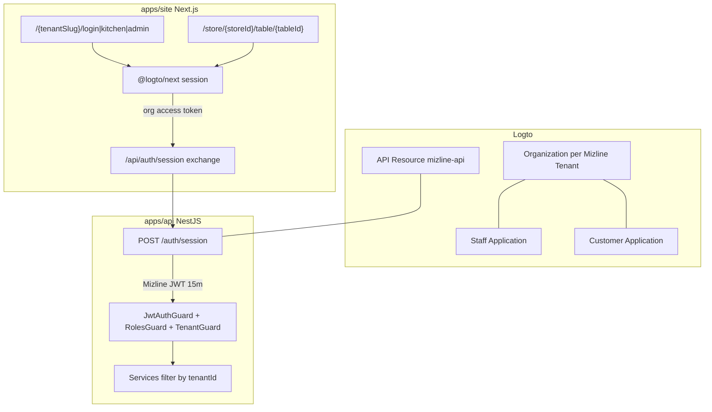
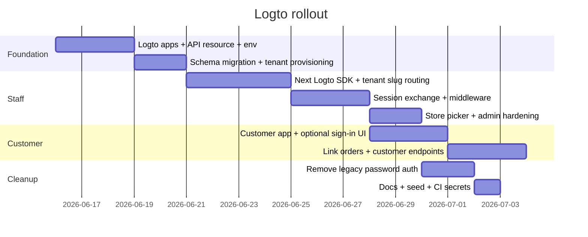

# Logto Multi-Tenant SSO Plan

## Current state

- **Staff**: email/password → self-signed JWT (`tenantId`, `role`, `storeIds`) + DB refresh cookie ([`auth.service.ts`](apps/api/src/auth/auth.service.ts), [`middleware.ts`](apps/site/middleware.ts))
- **Customer**: fully anonymous; table context from URL only ([`.cursor/rules/authentication.mdc`](.cursor/rules/authentication.mdc))
- **Tenancy**: `Tenant.slug` exists in DB but is unused; staff UI uses a cosmetic `[path]` segment and a single env-bound store (`NEXT_PUBLIC_KITCHEN_STORE_ID`)
- **Logto**: no integration today

## Target architecture



### Core mapping

| Mizline | Logto |
|---------|-------|
| `Tenant` | Organization (1:1) |
| `Tenant.slug` | URL segment + org routing hint |
| `User` (staff) | Identity `sub` + org membership + org roles |
| `Customer` (new) | Identity `sub` in customer app (no staff roles) |
| Staff permissions | Mizline DB `StaffRole` + `UserStore` (source of truth) |
| Enterprise SSO | Per-organization SSO connector (Azure AD, Okta, etc.) |

**Recommended token strategy**: Logto handles sign-in/SSO/session; Nest keeps validating **Mizline-issued JWTs** via a new **session exchange** endpoint. This avoids rewriting every guard, Socket.IO auth, and `staff-proxy.ts` in one step.

---

## 1. Logto tenant setup (infra)

### Applications (2)

| App | Type | Redirect URIs | Purpose |
|-----|------|---------------|---------|
| Mizline Staff | Traditional web (Next.js) | `https://{site}/callback`, dev localhost | Kitchen + admin |
| Mizline Customer | SPA / traditional web | same pattern under customer routes | Optional guest accounts |

Both apps share one Logto tenant so **SSO is automatic** across staff and customer surfaces.

### API resource

Register `https://api.mizline.com` (or env-specific indicator) in Logto with **organization-level permissions**, e.g.:

- `staff:read`, `staff:write`, `admin:read`, `admin:write`
- `customer:read` (optional account features)

Staff sign-in requests `UserScope.Organizations` and fetches an **organization token** for the tenant resolved from URL slug ([Logto org token docs](https://docs.logto.io/quick-starts/next-app-router)).

### Organization template (Logto-side hints only)

Define org roles like `barista`, `manager`, `tenant_admin` in Logto for invitation/JIT UX, but **Mizline DB remains authoritative** for API authorization (`StaffRole`, `UserStore`). Sync direction: Logto invite → provision `User` row; role changes in Mizline admin → optional Management API sync back.

### Enterprise SSO

Per tenant organization in Logto Console / Management API:

- Configure SSO connector (SAML/OIDC) for customer’s IdP
- Enable domain-based JIT provisioning into that organization
- Staff visiting `/{tenantSlug}/login` gets org-scoped sign-in experience automatically

### Environment variables (new)

**Site** (`apps/site/.env.example`):

- `LOGTO_ENDPOINT`, `LOGTO_APP_ID`, `LOGTO_APP_SECRET`, `LOGTO_COOKIE_SECRET`
- `LOGTO_CUSTOMER_APP_ID`, `LOGTO_CUSTOMER_APP_SECRET` (if separate app)
- `LOGTO_API_RESOURCE` (resource indicator)

**API** (`apps/api/.env.example`):

- `LOGTO_ENDPOINT`, `LOGTO_API_RESOURCE`
- Keep `JWT_SECRET` short-term for exchanged Mizline tokens

---

## 2. Database & provisioning changes

### Schema ([`schema.prisma`](apps/api/prisma/schema.prisma))

```prisma
model Tenant {
  // existing fields
  logtoOrganizationId String? @unique
}

model User {
  // existing fields
  logtoUserId  String?  // Logto sub
  passwordHash String?  // nullable during migration, then remove
  @@unique([tenantId, logtoUserId])
}

model Customer {
  id          String   @id @default(cuid())
  logtoUserId String   @unique
  email       String?
  name        String?
  createdAt   DateTime @default(now())
  orders      Order[]
}

model Order {
  // existing fields
  customerId String?
  customer   Customer? @relation(...)
}
```

### Tenant onboarding service

New `TenantsService` (or extend admin/platform module):

1. Create `Tenant` row with `slug`
2. Call Logto Management API → `POST /organizations` → store `logtoOrganizationId`
3. Seed default store(s) as today

### Staff user provisioning

Update [`staff.service.ts`](apps/api/src/staff/staff.service.ts):

- Stop generating bcrypt passwords for new users
- Invite via Logto Management API (`POST /organizations/{id}/invitations`) with org role hint
- On first login exchange, **JIT link** `User.logtoUserId = sub` if invitation email matches

---

## 3. Multi-tenancy: tenant slug in staff URLs

Replace cosmetic `[path]` with validated **tenant slug**.

### Routing

- Keep route folder [`apps/site/app/[path]/`](apps/site/app/[path]/) but treat segment as `tenantSlug`
- Add server helper `resolveTenantFromSlug(slug)` → `{ tenantId, logtoOrganizationId, stores[] }`
- Invalid slug → 404 (not login loop)

### Middleware ([`middleware.ts`](apps/site/middleware.ts))

- For `/{tenantSlug}/kitchen|admin`: require Logto session cookie (from `@logto/next`) instead of `mizline_refresh`
- Validate slug against cached tenant list or lightweight API lookup
- Redirect unauthenticated users to `/{tenantSlug}/login?next=...`

### Store context (deprecate single-store env)

Today [`resolveStaffStoreId`](apps/site/lib/auth-session.ts) falls back to `NEXT_PUBLIC_KITCHEN_STORE_ID`. After migration:

1. Prefer `user.storeIds[0]` when only one store
2. If multiple → store picker persisted in cookie/localStorage
3. Keep env fallback **dev-only**

### API tenant enforcement (harden)

Keep [`TenantGuard`](apps/api/src/auth/guards/auth.guards.ts) but add service-level `assertStoreInTenant(tenantId, storeId)` to [`AdminService`](apps/api/src/admin/admin.service.ts) (gap today). Every staff query continues filtering by `user.tenantId` from exchanged JWT.

---

## 4. Staff SSO implementation

### Next.js integration

1. Add `@logto/next` per [App Router quick start](https://docs.logto.io/quick-starts/next-app-router)
2. Add route handlers: `/api/logto/[action]` (sign-in, sign-out, callback)
3. Replace [`login-form.tsx`](apps/site/components/login-form.tsx) with **“Sign in with SSO”** button calling `signIn()` with:
   - `organizationId` from tenant slug lookup
   - scopes: `openid`, `profile`, `organizations`, API scopes
4. Replace [`auth-session.ts`](apps/site/lib/auth-session.ts) flow:
   - `loadAuthSession()` → get Logto session → call BFF exchange → set in-memory Mizline JWT
5. Remove legacy routes: [`/api/auth/login`](apps/site/app/api/auth/login/route.ts), refresh, logout (or shim to Logto sign-out)

### Session exchange (BFF + API)

**Next BFF** `POST /api/auth/session`:

```typescript
// Pseudocode
const logtoToken = await getOrganizationToken(logtoConfig, orgId);
const res = await fetch(`${API}/auth/session`, {
  headers: { Authorization: `Bearer ${logtoToken}` },
  body: JSON.stringify({ tenantSlug }),
});
// returns { accessToken, user } — same shape as today
```

**Nest** `POST /auth/session` in [`auth.controller.ts`](apps/api/src/auth/auth.controller.ts):

1. Validate Logto org token via JWKS (`jose`, issuer, aud, `organization_id`) — follow [Logto API validation guide](https://docs.logto.io/authorization/validate-access-tokens)
2. Map `organization_id` → `Tenant` via `logtoOrganizationId`
3. Assert URL `tenantSlug` matches tenant (anti-confusion)
4. Load/create staff `User` by `logtoUserId` + `tenantId`
5. Issue existing Mizline JWT payload (`sub`, `tenantId`, `role`, `storeIds`)
6. Return `AuthUser` (same shared type)

Existing guards, [`staff-proxy.ts`](apps/site/lib/staff-proxy.ts), and realtime JWT verification keep working with minimal changes.

### Socket.IO ([`orders.gateway.ts`](apps/api/src/realtime/orders.gateway.ts))

Continue accepting Mizline JWT from exchanged token. Staff connects same as today after client refresh via BFF.

### Migration / coexistence

- Phase A: Logto login + exchange alongside legacy password login (feature flag)
- Phase B: Migrate seed users to Logto identities; mark passwords deprecated
- Phase C: Remove `RefreshToken` model, `mizline_refresh` cookie, bcrypt, [`LoginDto`](apps/api/src/auth/dto/login.dto.ts)

---

## 5. Customer SSO (optional accounts)

**Product rule (confirmed)**: anonymous ordering stays default; sign-in is optional.

### UX

On [`table-ordering.tsx`](apps/site/components/table-ordering.tsx) / order tracking:

- “Sign in” → Logto customer app sign-in (social + enterprise if configured at platform level)
- After sign-in, show account badge + “My orders at this store”
- No gate on checkout

### Auth scope

Customer tokens do **not** need organization membership for basic identity. Tenant/store context comes from the **store URL**:

- `storeId` → lookup `store.tenantId` for any tenant-scoped customer data
- Prevent cross-tenant leaks: customer endpoints filter by `store.tenantId` derived from `storeId`, never from client-supplied `tenantId`

### API additions

| Endpoint | Auth | Behavior |
|----------|------|----------|
| `POST /auth/customer/session` | Logto user token | Upsert `Customer`, return short-lived customer JWT (optional) or session id |
| `POST /orders/:id/link` | Customer auth | Attach `customerId` to order guest just placed |
| `GET /stores/:storeId/customer/orders` | Customer auth | List orders for this store + customer |

Anonymous endpoints unchanged: [`stores.controller.ts`](apps/api/src/stores/stores.controller.ts), public order create/read.

### Linking anonymous orders

After optional sign-in, client calls link endpoint with order IDs from localStorage (`mizline-cart:{storeId}:{tableId}` pattern in [`orders.ts`](apps/site/lib/orders.ts)).

### Realtime for customers

Today customer sockets join without JWT. Keep public `joinOrder` for anonymous tracking; authenticated customers can additionally join a `customer:{id}` room later (Phase 2 polish).

---

## 6. Security checklist

- Every tenant-owned query keeps `tenantId` filter ([multi-tenant rule](.cursor/rules/multi-tenant.mdc))
- Staff: `organization_id` in Logto token must match resolved tenant; `TenantGuard` + `assertStoreInTenant`
- Customer: never trust client `tenantId`; derive from `storeId`
- Remove global email lookup in login ([`findFirst({ email })`](apps/api/src/auth/auth.service.ts)) — staff identity scoped to org/tenant
- Rotate off self-managed refresh tokens to Logto session handling
- Dev bypass (`KITCHEN_DEV_TOKEN`): keep behind `NODE_ENV=development` only

---

## 7. Implementation phases



### Files most touched

| Area | Files |
|------|-------|
| Schema/seed | [`schema.prisma`](apps/api/prisma/schema.prisma), [`seed.ts`](apps/api/prisma/seed.ts) |
| Nest auth | [`auth.module.ts`](apps/api/src/auth/auth.module.ts), `auth.service.ts`, new `logto.service.ts`, `jwt.strategy.ts` |
| Next auth | `middleware.ts`, [`auth-session.ts`](apps/site/lib/auth-session.ts), new `lib/logto.ts`, `[path]/login/page.tsx` |
| Routing | [`site-path.ts`](apps/site/lib/site-path.ts), [`path-provider.tsx`](apps/site/components/path-provider.tsx) |
| Customer | [`table-ordering.tsx`](apps/site/components/table-ordering.tsx), new customer session routes |
| Shared types | [`packages/shared/src/types.ts`](packages/shared/src/types.ts) |
| Infra | [`apps/site/.env.example`](apps/site/.env.example), [`apps/api/.env.example`](apps/api/.env.example), k8s secrets |

### Testing plan

1. **Staff**: `/{tenantSlug}/login` → SSO → kitchen/admin access; barista blocked from admin; cross-tenant slug rejected
2. **Enterprise SSO**: IdP login lands in correct org; JIT creates `User` with correct `tenantId`
3. **Customer**: order anonymously → sign in → link order → see in “my orders”; other tenant/store isolation verified
4. **SSO across apps**: sign in on customer app, open staff app → silent re-auth where applicable
5. **Regression**: KDS realtime, admin CRUD, order flow unchanged for anonymous guests

---

## Out of scope (unless requested later)

Payment, loyalty, coupons ([`future-features.mdc`](.cursor/rules/future-features.mdc)) — customer SSO here only enables identity + order linking, not a full loyalty program.
